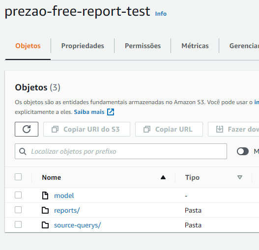

# Excel report automate

There are a test for an approach to supply one demand which needed the generation of daily excel reports as data was generated for transactional software. The accept criteria are:

- All reports must to update in D-1 and avaiable on s3 bucket
- The excel file structure isn't enable for alterations
- There is necessary to document all involved process to generate this
- Consider handover to operations team

Looking for that, there were assumed some premises:

- There will possible to generate a consolidated table for this job
- There will enable a s3 bucket just for theses excel reports
- There will some way to know the reports which is necessary to generate report
- It will be possible generate a AWS lambda for this job 

You can look for report model [here](/reportmodel)

## Local solution validation

And, there are the solution tested in this repository:


There was used just windows directorys to test the logical, and after that will be tested on AWS.
For test this, you just can clone this repository,

```bash
git clone https://github.com/SartMorgs/excel_report_automate
```

active venv python environement and install all requirements.

```bash
python -m venv
pip install -r requirements.txt --no-index
```

After that you can just run the scripts on code directory. There are two scripts, which one are for first run mock data source and another for another later run mock data source.

```bash
python code/script.py
python code/new_script.py
```

## Solution test on AWS S3

First of all I need to access some AWS services, and for this is necessary to configure aws credentials. I am using federated access for this, beacause I can have temporary credentials.

```bash
saml2aws login
```

Now the model easily be uploaded on bucket, 

```bash
aws s3 mv reportmodel/model.xlsx s3://bucket-name
```

There are necessary to create folders, you can do that on console or with IaaC, doesn't matter for now. 



So, for replicate the test done in this case, using [this codew](code/s2_script.py), you can run these command:

```bash
python code/s3_script.py
```